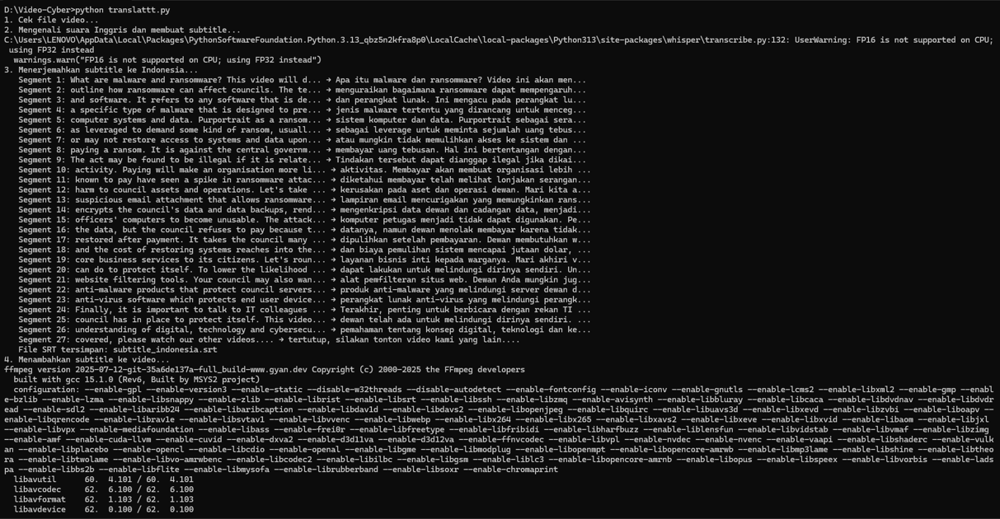
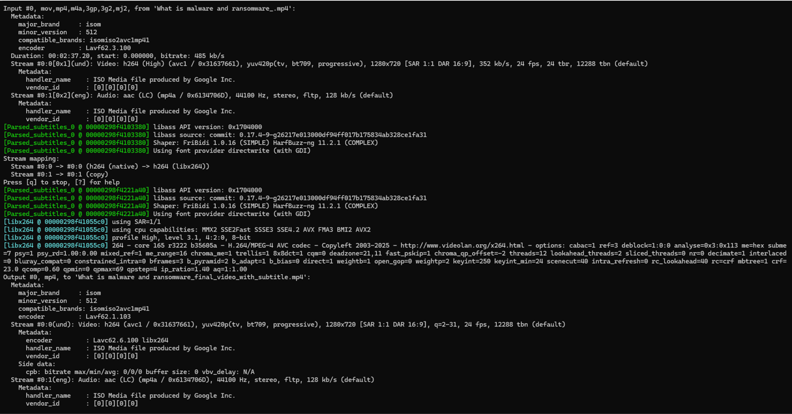
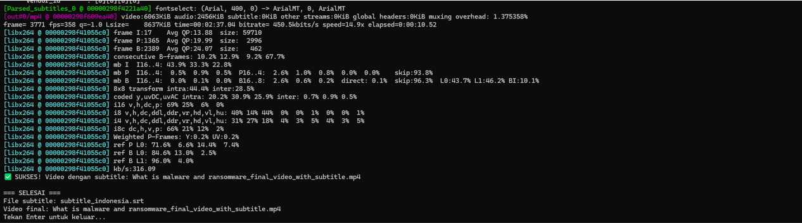

# 🎬 English Video → Indonesian Subtitle Generator

> 🚀 Otomatis menerjemahkan video berbahasa Inggris menjadi subtitle Bahasa Indonesia menggunakan AI.


---

# 📖 Deskripsi

Pernah menemukan video berbahasa Inggris tetapi kesulitan memahami percakapannya?

Project ini membantu Anda:

✅ Mengubah suara bahasa Inggris menjadi teks otomatis  
✅ Menerjemahkan teks ke Bahasa Indonesia  
✅ Membuat file subtitle (.srt)  
✅ Menempel subtitle langsung ke video

Semua proses dilakukan secara otomatis menggunakan teknologi AI.

---

# 🎯 Cocok Untuk

| Pengguna | Manfaat |
|-----------|-----------|
| 🎥 Content Creator | Membuat subtitle konten lebih cepat |
| 👨‍🏫 Guru & Dosen | Menggunakan video luar negeri untuk pembelajaran |
| 🎓 Mahasiswa | Memahami video edukasi berbahasa Inggris |
| 🌍 Umum | Menonton video internasional dengan mudah |

---

# ⚡ Cara Kerja

```text
Video Inggris
      │
      ▼
OpenAI Whisper
(Speech-to-Text)
      │
      ▼
Google Translate
(English → Indonesia)
      │
      ▼
Subtitle (.srt)
      │
      ▼
FFmpeg
(Burn Subtitle)
      │
      ▼
Video Final Indonesia
```

---

# 📂 Struktur Project

```text
project-folder/
│
├── translator.py
├── video_inggris.mp4
│
├── subtitle_indonesia.srt
├── final_video.mp4
│
└── README.md
```

---

# 🔥 Fitur

- Automatic Speech Recognition (ASR)
- Subtitle Bahasa Indonesia Otomatis
- Support MP4 Video
- Menggunakan AI Whisper
- Hasil Subtitle Format SRT
- Burn Subtitle ke Video
- Gratis dan Open Source

---

# 🖥️ Persyaratan Sistem

### Minimum

- Python 3.7+
- RAM 4 GB
- FFmpeg

### Rekomendasi

- Python 3.10+
- RAM 8 GB+
- SSD Storage

---

# 📦 Instalasi

## 1. Install FFmpeg

### Windows

Download:

https://ffmpeg.org/download.html

Pastikan ffmpeg sudah masuk ke PATH.

```bash
ffmpeg -version
```

### Linux

```bash
sudo apt update
sudo apt install ffmpeg
```

### macOS

```bash
brew install ffmpeg
```

---

## 2. Install Python Library

```bash
pip install openai-whisper deep-translator
```

---

# 🚀 Cara Penggunaan

## 1. Masukkan Video

Taruh video yang ingin diterjemahkan ke folder project.

## 2. Atur Nama Video

```python
video_path = "video_inggris.mp4"
```

## 3. Jalankan Program

```bash
python translator.py
```

## 4. Tunggu Proses Selesai

Program akan:
1. Membaca suara video
2. Membuat transkripsi bahasa Inggris
3. Menerjemahkan ke Bahasa Indonesia
4. Membuat file subtitle
5. Menempel subtitle ke video

---

# 📁 Output

```text
subtitle_indonesia.srt
final_video.mp4
```
## Screenshot

<p align="center">
  
  
  
</p>

---

# 📜 License

MIT License

⭐ Jika project ini membantu, jangan lupa berikan Star di GitHub.
